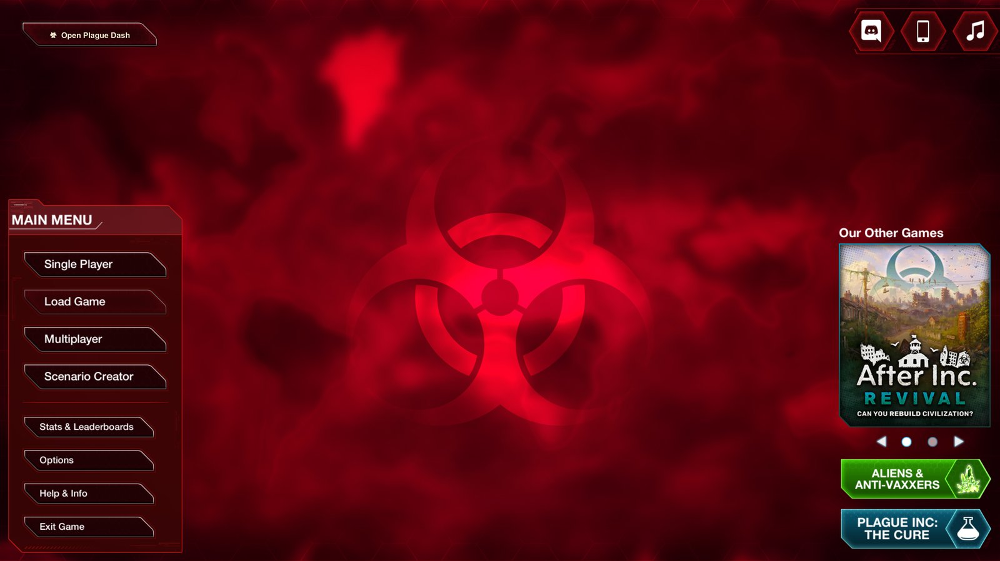
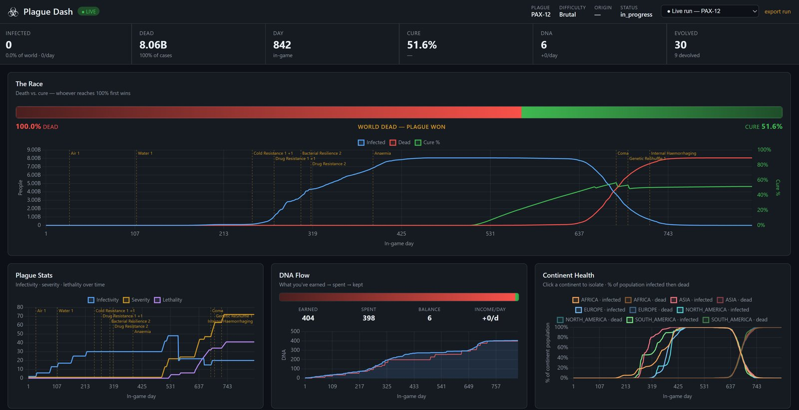

# ☣ Plague Dash

A live dashboard mod for **Plague Inc: Evolved** — plots your run as it happens:
the death-vs-cure race, your plague's stats, the DNA economy, infections across
every continent, and every trait you evolve, marked on the timeline so you can
see what each decision *did*.

> ⚠ **Single-player only — multiplayer is disabled.** Plague Dash gives you a
> competitive information advantage, so using it in multiplayer (Versus or Co-op)
> could get you banned. The mod **removes the Multiplayer button from the main
> menu entirely** and refuses to collect data if a multiplayer game is somehow
> started. Disable Plague Dash in UMM to access multiplayer.

<p align="center">
  <br>
  <em>An "☣ Open Plague Dash" button is added to the main menu — one click launches the dashboard.</em>
</p>

<p align="center">
  <br>
  <em>The dashboard, live during a Brutal PAX-12 run.</em>
</p>

The mod **is** the server. One DLL, no files on disk, no separate program to run:
install it, start the game, click the menu button (or open
`http://localhost:8765`), and put the browser on a second monitor.

---

## Install (for players)

You need **[UnityModManager](https://www.nexusmods.com/site/mods/21)** (UMM) set
up for Plague Inc: Evolved first — Plague Dash is a standard UMM mod.

1. **Set up UMM** (once, ever): download UMM, run it, pick *Plague Inc: Evolved*,
   point it at your install (`…\Steam\steamapps\common\PlagueInc`), and Install.
2. **Download the latest `PlagueDash.zip`** from the
   [Releases page](https://github.com/tkon99/plague-dash/releases).
3. **Install it via UMM** — either drag the zip onto UMM's mod list, or unzip it
   into `…\PlagueInc\Mods\PlagueDash\` so you have:
   ```
   PlagueInc/Mods/PlagueDash/
     ├─ Info.json
     └─ PlagueDash.dll
   ```
4. Launch Plague Inc: Evolved, open the UMM in-game menu, and **enable Plague Dash**.

That's it. On the main menu, the **☣ Open Plague Dash** button appears bottom-right;
click it (or open `http://localhost:8765`) and start a run. Charts fill in live.

> **Verified against:** UMM 0.32.5, Unity 2019.4.412, Plague Inc build July 2026.
> The mod patches game methods *by name* (not byte offsets), so it's resilient to
> minor game updates — but a large game patch could rename a method. If a chart
> goes flat after a game update, check the [troubleshooting](mod/README.md#troubleshooting)
> notes.

---

## What the dashboard shows

Every view answers one question. No tabs — it's all on one screen.

| View | What it tells you |
|---|---|
| **The Race** | A gauge splitting dead-vs-cure by who's dominating, plus the headline chart of infections, deaths and cure % over time. The single at-a-glance "am I winning" read. |
| **Plague Stats** | Infectivity · severity · lethality over time — the ramps as your outbreak matures (e.g. the lethality spike after evolving Total Organ Failure). |
| **DNA Flow** | What you've earned → spent → kept, with income per day and a sparkline of the economy. |
| **Continent Health** | Each continent's population as a % over time: the infected wave rising, then the dead wave overtaking it. |
| **Trait Timeline** | Every evolve/devolve as an event on the day axis — colored by category, sized by cost, hollow = devolved. |
| **Trait Planner** | Everything you can evolve right now, sorted by what you can afford, with each trait's cost and stat effects (green = helps you, red = hurts). |
| **Country Breakdown** | Latest per-country table: infected, % of population, continent. |

The **evolve markers** are the centerpiece: dashed amber lines on the Race and
Plague Stats charts mark each trait you evolved, labeled with its name — so you
can literally see "I evolved Total Organ Failure here → lethality spiked → the
cure accelerated." Same-day multi-evolves collapse into one label ("Insomnia +5").

Completed runs are **archived automatically** when you start a new game — a
run selector in the header switches between the live run and up to 5 past runs
from your session, and **Export run** downloads the current view as JSON.

---

## For developers / contributors

The mod is C# / .NET Framework 4.8 that compiles against your local Plague Inc
install. Full build + architecture docs live in **[`mod/README.md`](mod/README.md)**.

```
plague-dash/
├─ mod/              # the self-contained UMM mod (C# source) — build target
│  ├─ Patches/             # Harmony patches reading live game state
│  ├─ DashboardServer.cs   # embedded TcpListener: serves UI + SSE stream
│  ├─ LiveState.cs         # in-memory store (history + meta + countries)
│  ├─ build.bat            # one-command build + deploy
│  └─ README.md            # build + install + architecture docs
├─ dashboard/        # dashboard UI source — baked into the DLL at build time
│  ├─ index.html / style.css / app.js
│  └─ vendor/chart.js      # vendored Chart.js 4.4.1 (embedded)
├─ tools/            # dev-only: mock server + export/analyze scripts
└─ docs/img/         # README screenshots
```

`dashboard/` and `tools/` are **build-time inputs / dev tooling**, not runtime
components. The shipped artifact is just `PlagueDash.dll` + `Info.json`.

### How it works

```
 Plague Inc + UMM mod  ──(Harmony patch reads live game state)──▶  in-memory LiveState
                                                                     │
                                          browser ◀── SSE stream ────┤  (embedded TcpListener
                                        (EventSource)                 serves dashboard UI +
                                                                       Chart.js from the DLL)
```

Plague Inc: Evolved is a Unity/Mono game. UMM loads this mod into the same
runtime, and [Harmony](https://github.com/pardeike/Harmony) weaves postfixes onto
the game's per-tick update and trait-evolve methods. After each tick we read the
live fields off the disease object and, when the in-game day advances, publish a
sample. The embedded `DashboardServer` serves the dashboard UI + Chart.js
(embedded resources baked into the DLL) and streams the data to the browser over
Server-Sent Events (`GET /events`). No files are written to disk.

This patches *methods by name*, not byte offsets — far more robust across game
updates than memory scanning or save-file parsing.

### Building from source

Prerequisites: **Visual Studio 2022 Build Tools** (for MSBuild) and **UMM
installed for Plague Inc** (which drops the modding DLLs the project references).

```
cd mod
build.bat            # builds Release + deploys to the game's Mods folder
build.bat /nodeploy  # build only
```

Then enable **Plague Dash** in UMM and launch the game. See
[`mod/README.md`](mod/README.md) for full details, troubleshooting, and how to
tune field names for a newer game version.

### Mock server (dashboard dev without the game)

The dashboard can be developed and tested without the game running:

```
python tools/mock_dashboard.py     # serves a fake live SSE stream on :8766
```

It replays a run export (`data/plague-dash-export.json`) as if it were the live
game — samples and evolve events interleaved by day, plus a synthesized archived
run so the run-history selector can be exercised. Open `http://localhost:8766`.

### Releasing a new version

Releases are built locally (the mod compiles against the game's proprietary
DLLs, which can't go on a CI runner) and published via GitHub Actions:

```
# from the repo root, after a clean build:
python tools/release.py 0.2.0        # builds, packages PlagueDash.zip, tags, pushes
```

The `v*` tag triggers `.github/workflows/release.yml`, which creates the GitHub
Release and attaches the staged zip. See the script header for details.

---

## Credits

The disease/cure field names the mod reads were cross-checked against the
research behind:
- [PIStatsOverlay](https://github.com/LittleYe233/PIStatsOverlay) (MIT)
- [plaguechanges](https://github.com/sschr15/plaguechanges) (MPL-2.0)

This project reuses **no code** from either; it adds the time-series recording +
dashboard layer that neither provides.

## License

[MIT](LICENSE) — the mod and dashboard source in this repository is original
work, free to use, modify, and distribute with attribution.

Plague Dash is a mod for Plague Inc: Evolved, which is the property of Ndemic
Creations. This project is not affiliated with or endorsed by Ndemic, and this
license covers only the original code here — not the game or its proprietary
assemblies that the mod compiles against but does not redistribute. The bundled
[Chart.js](https://github.com/chartjs/Chart.js) is MIT-licensed by its contributors.
